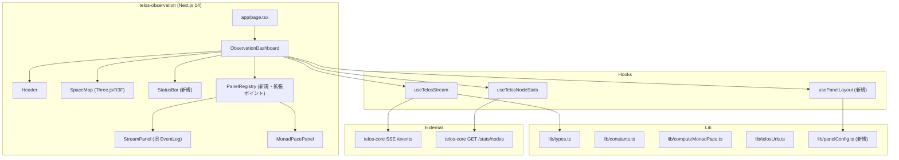
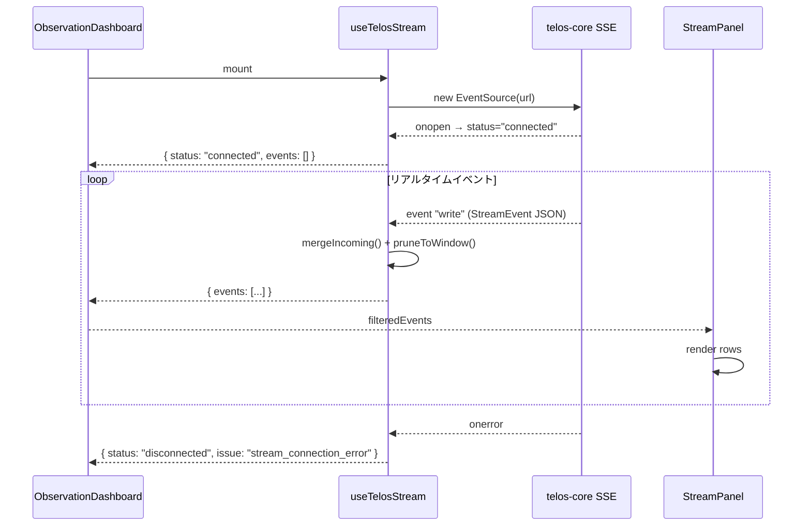
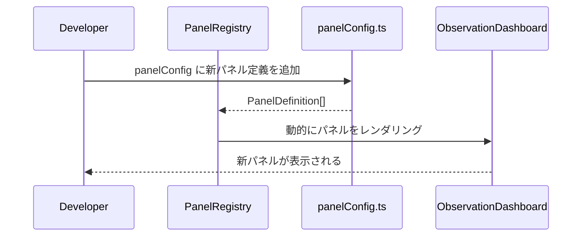

# Design Document: telos-observation UI Redesign

## Overview

telos-observation は、複数の AI Monad が共有ベクターDBに書き込む様子をリアルタイムで可視化する観測 UI である。
本リデザインでは、(1) "pheromone stream" という内部用語を "stream" に統一、(2) Palantir Gotham を参考にした高品質なオペレーショナル UI の実現、(3) 将来的な情報追加・変更に対応できる拡張性の高い設計、の3点を目標とする。

既存スタックは Next.js 14 (App Router) + BlueprintJS v6 + Three.js (R3F) + D3.js + Tailwind CSS であり、これらを維持しながら UI 品質を大幅に向上させる。

---

## Architecture



---

## Sequence Diagrams

### SSE 接続とイベント処理フロー



### パネル拡張フロー（将来対応）



---

## Components and Interfaces

### Component 1: ObservationDashboard

**Purpose**: アプリ全体のレイアウトと状態管理を担うルートコンポーネント。

**Interface**:
```typescript
// props なし（ページルートコンポーネント）
export function ObservationDashboard(): JSX.Element
```

**Responsibilities**:
- `useTelosStream` / `useTelosNodeStats` フックの呼び出し
- monad フィルタ状態の管理
- `PanelRegistry` へのデータ配布
- レイアウト構造（Header + SpaceMap + BottomPanels）の定義

---

### Component 2: Header (改修)

**Purpose**: ナビゲーションバー。接続状態・統計・monad フィルタを表示。

**Interface**:
```typescript
type HeaderProps = {
  status: "connected" | "disconnected";
  streamIssue?: StreamIssue;
  monadCount: number;
  writeCount: number;
  monadIds: string[];
  selectedMonads: string[];
  onMonadsChange: (ids: string[]) => void;
  qdrantNodes: number | null;
  nodeStatsStatus: NodeStatsHeaderStatus;
  // 拡張ポイント: 将来的な追加統計
  extraStats?: StatItem[];
};

type StatItem = {
  label: string;
  value: string | number;
  intent?: "none" | "primary" | "success" | "warning" | "danger";
};
```

**Responsibilities**:
- LIVE / OFFLINE インジケーター表示
- Qdrant nodes / Monads / Writes (1h) 統計表示
- Monad フィルタ (BlueprintJS MultiSelect)
- `extraStats` による将来の統計追加対応

**変更点**:
- `stat-value` の色を `--accent-green` から `--text-primary` に変更（Gotham スタイル）
- ヘッダー高さを 40px → 48px に拡大し情報密度を向上
- 統計エリアに `StatItem[]` 拡張ポイントを追加

---

### Component 3: StreamPanel (旧 EventLog、改名)

**Purpose**: SSE ストリームイベントのリアルタイムログ表示。

**Interface**:
```typescript
type StreamPanelProps = {
  events: StreamEvent[];
  maxRows?: number; // default: 100
};

export function StreamPanel({ events, maxRows = 100 }: StreamPanelProps): JSX.Element
```

**Responsibilities**:
- イベント行のレンダリング（monad_id / timestamp / content / linked IDs）
- 新着イベントのフラッシュアニメーション
- 空状態の表示（"Waiting for stream events..."）

**変更点**:
- コンポーネント名: `EventLog` → `StreamPanel`
- ファイル名: `EventLog.tsx` → `StreamPanel.tsx`
- 空状態テキスト: "Waiting for pheromones..." → "Waiting for stream events..."
- パネルタイトル: "Pheromone Stream" → "Stream"
- 行レイアウトを Gotham スタイルのグリッド表示に改善

---

### Component 4: SpaceMap (改修)

**Purpose**: Three.js/R3F による 3D パーティクルビジュアライゼーション。

**Interface**:
```typescript
type SpaceMapProps = {
  events: StreamEvent[];
};

export function SpaceMap({ events }: SpaceMapProps): JSX.Element
```

**変更点**:
- パーティクルサイズ・輝度の調整（Gotham の精密感に合わせる）
- グリッドオーバーレイの追加（Three.js GridHelper）
- カメラ初期位置の最適化

---

### Component 5: MonadPacePanel (改修)

**Purpose**: Monad ごとの書き込みペース（1h ウィンドウ）を表示。

**Interface**:
```typescript
type MonadPacePanelProps = {
  rows: MonadPaceRow[];
};
```

**変更点**:
- バーチャートの追加（D3.js または CSS width による相対バー）
- 最大値に対する相対バー幅の視覚化

---

### Component 6: StatusBar (新規)

**Purpose**: 画面下部のステータスバー。接続詳細・タイムスタンプ・システム情報を表示。

**Interface**:
```typescript
type StatusBarProps = {
  streamIssue: StreamIssue;
  lastEventAt: number | null; // timestamp ms
  // 拡張ポイント
  extraInfo?: StatusBarItem[];
};

type StatusBarItem = {
  key: string;
  label: string;
  value: string;
};

export function StatusBar(props: StatusBarProps): JSX.Element
```

**Responsibilities**:
- 最終イベント受信時刻の表示
- ストリーム接続エラーの詳細メッセージ
- 将来的な追加ステータス情報の表示

---

### Component 7: PanelRegistry (新規・拡張ポイント)

**Purpose**: ボトムパネルエリアの動的パネル管理。将来のパネル追加を容易にする。

**Interface**:
```typescript
type PanelDefinition = {
  id: string;
  title: string;
  titleColor?: string; // CSS variable or hex
  widthRatio?: number; // flex ratio, default 1
  component: React.ComponentType<PanelComponentProps>;
};

type PanelComponentProps = {
  events: StreamEvent[];
  selectedMonads: string[];
};

type PanelRegistryProps = {
  panels: PanelDefinition[];
  events: StreamEvent[];
  selectedMonads: string[];
};

export function PanelRegistry(props: PanelRegistryProps): JSX.Element
```

**Responsibilities**:
- `PanelDefinition[]` に基づいてパネルを動的レンダリング
- パネル間のボーダー・タイトルバーの統一スタイル適用
- 新パネルは `panelConfig.ts` に定義を追加するだけで表示される

---

## Data Models

### StreamEvent (既存・変更なし)

```typescript
interface StreamEvent {
  id: string;
  monad_id: string;
  content: string;
  parent_ids: string[];
  timestamp: number; // ms
  nearest: {
    id: string;
    monad_id: string;
    content: string;
    score: number;
    timestamp: number;
    x?: number;
    y?: number;
    z?: number;
  }[];
  x?: number;
  y?: number;
  z?: number;
}
```

### MonadPaceRow (既存・変更なし)

```typescript
interface MonadPaceRow {
  monad_id: string;
  countLastHour: number;
  writesPerHour: number;
}
```

### StatItem (新規)

```typescript
interface StatItem {
  label: string;
  value: string | number;
  intent?: "none" | "primary" | "success" | "warning" | "danger";
}
```

**Validation Rules**:
- `label` は空文字列不可
- `value` は表示可能な値（string または number）

### PanelDefinition (新規)

```typescript
interface PanelDefinition {
  id: string;           // ユニークID
  title: string;        // パネルタイトル
  titleColor?: string;  // CSS変数またはhex色
  widthRatio?: number;  // フレックス比率 (default: 1)
  component: React.ComponentType<PanelComponentProps>;
}
```

**Validation Rules**:
- `id` はアプリ内でユニーク
- `widthRatio` は正の数値

---

## Algorithmic Pseudocode

### パネル動的レンダリングアルゴリズム

```pascal
ALGORITHM renderPanelRegistry(panels, events, selectedMonads)
INPUT: panels: PanelDefinition[], events: StreamEvent[], selectedMonads: string[]
OUTPUT: JSX.Element (パネルコンテナ)

BEGIN
  filteredEvents ← filterByMonads(events, selectedMonads)
  
  FOR each panel IN panels DO
    ASSERT panel.id IS unique
    
    PanelComponent ← panel.component
    flexRatio ← panel.widthRatio ?? 1
    
    RENDER:
      <div style={{ flex: flexRatio }}>
        <PanelTitleBar title={panel.title} color={panel.titleColor} />
        <PanelComponent events={filteredEvents} selectedMonads={selectedMonads} />
      </div>
  END FOR
END
```

### 用語置換アルゴリズム（"pheromone" → "stream"）

```pascal
ALGORITHM renamePheromoneToStream(codebase)
INPUT: codebase: ファイルセット
OUTPUT: 変更ファイルセット

BEGIN
  targets ← [
    { file: "EventLog.tsx",           rename_to: "StreamPanel.tsx" },
    { file: "ObservationDashboard.tsx", strings: ["Pheromone Stream"] → ["Stream"] },
    { file: "EventLog.tsx",           strings: ["Waiting for pheromones..."] → ["Waiting for stream events..."] }
  ]
  
  FOR each target IN targets DO
    IF target.rename_to EXISTS THEN
      renameFile(target.file, target.rename_to)
    END IF
    
    IF target.strings EXISTS THEN
      FOR each (old, new) IN target.strings DO
        replaceAll(target.file, old, new)
      END FOR
    END IF
  END FOR
END
```

---

## Key Functions with Formal Specifications

### filterByMonads()

```typescript
function filterByMonads(events: StreamEvent[], selectedMonads: string[]): StreamEvent[]
```

**Preconditions:**
- `events` は非null の配列
- `selectedMonads` は非null の配列

**Postconditions:**
- `selectedMonads.length === 0` の場合、`events` をそのまま返す
- `selectedMonads.length > 0` の場合、`result` の全要素は `selectedMonads` に含まれる `monad_id` を持つ
- 入力 `events` は変更されない

### computeMonadPace()

```typescript
function computeMonadPace(events: StreamEvent[]): MonadPaceRow[]
```

**Preconditions:**
- `events` は非null の配列（空配列可）

**Postconditions:**
- 返り値は `writesPerHour` の降順でソートされる
- 各 `monad_id` は結果に1度だけ現れる
- `monad_id` が空文字列の場合は `"(unknown)"` として集計される

---

## Design Tokens (Gotham スタイル)

現在の CSS 変数を Palantir Gotham の視覚言語に合わせて拡張する。

```css
:root {
  /* 既存トークン（維持） */
  --bg-base: #080c10;
  --bg-panel: #0d1117;
  --bg-panel-hover: #111820;
  --border-subtle: #1e2d3d;
  --border-active: #2d9cdb;
  --accent-green: #00d4a0;
  --accent-blue: #2d9cdb;
  --accent-red: #e55353;
  --text-primary: #cdd9e5;
  --text-secondary: #768390;
  --text-muted: #444c56;

  /* 新規追加トークン */
  --accent-amber: #f0a500;       /* 警告・注意色 */
  --accent-cyan: #00b4d8;        /* ハイライト補助色 */
  --bg-header: #060a0e;          /* ヘッダー専用背景（より暗く） */
  --bg-statusbar: #060a0e;       /* ステータスバー背景 */
  --border-panel-title: #1e2d3d; /* パネルタイトルボーダー */
  --stat-value-color: #cdd9e5;   /* 統計値色（白系、Gotham スタイル） */
  --panel-title-height: 28px;    /* パネルタイトルバー高さ */
  --header-height: 48px;         /* ヘッダー高さ（40px → 48px） */
}
```

---

## Error Handling

### Error Scenario 1: SSE 接続失敗

**Condition**: `NEXT_PUBLIC_TELOS_STREAM_EVENTS_URL` が未設定
**Response**: `streamIssue = "missing_stream_events_url"` → Header に "OFFLINE (CONFIG)" 表示
**Recovery**: 環境変数設定後に dev server 再起動

### Error Scenario 2: SSE 接続エラー

**Condition**: EventSource の `onerror` 発火
**Response**: `streamIssue = "stream_connection_error"` → Header に "OFFLINE (CONNECTION)" 表示
**Recovery**: EventSource は自動再接続を試みる（ブラウザ標準動作）

### Error Scenario 3: Stats API エラー

**Condition**: `/stats/nodes` への fetch が失敗
**Response**: `nodeStatsStatus = "error"` → Header の Qdrant nodes に "!" 表示
**Recovery**: 45秒ごとのポーリングで自動リトライ

---

## Correctness Properties

*A property is a characteristic or behavior that should hold true across all valid executions of a system — essentially, a formal statement about what the system should do. Properties serve as the bridge between human-readable specifications and machine-verifiable correctness guarantees.*

### Property 1: filterByMonads — 空フィルタは全イベントを返す

For any non-null events array, `filterByMonads(events, [])` shall return a result with the same length as the input and containing the same elements.

**Validates: Requirements 9.1**

### Property 2: filterByMonads — フィルタ適用後の結果整合性

For any events array and any non-empty selectedMonads array, every event in the result of `filterByMonads(events, selectedMonads)` shall have a `monad_id` that is included in `selectedMonads`.

**Validates: Requirements 9.2**

### Property 3: filterByMonads — 入力配列の不変性

For any events array and any selectedMonads array, calling `filterByMonads(events, selectedMonads)` shall not mutate the original `events` array.

**Validates: Requirements 9.3**

### Property 4: computeMonadPace — 降順ソート

For any events array, the result of `computeMonadPace(events)` shall be sorted in descending order by `writesPerHour` (i.e., `result[i].writesPerHour >= result[i+1].writesPerHour` for all valid indices).

**Validates: Requirements 10.1**

### Property 5: computeMonadPace — monad_id の一意性

For any events array, the result of `computeMonadPace(events)` shall contain each `monad_id` at most once.

**Validates: Requirements 10.2**

### Property 6: StreamPanel — 行数の上限

For any events array with length greater than `maxRows`, the StreamPanel shall render at most `maxRows` rows.

**Validates: Requirements 3.4, 12.1**

### Property 7: StreamPanel — イベントフィールドの表示

For any non-empty events array, each rendered row in the StreamPanel shall include the event's `monad_id`, `timestamp`, `content`, and linked IDs.

**Validates: Requirements 3.1**

### Property 8: PanelRegistry — パネル数の一致

For any `PanelDefinition[]` array, the PanelRegistry shall render exactly as many panel containers as there are entries in the array.

**Validates: Requirements 7.1, 7.6**

### Property 9: PanelRegistry — widthRatio の適用

For any `PanelDefinition` with a defined `widthRatio`, the PanelRegistry shall apply that value as the flex ratio of the corresponding panel container.

**Validates: Requirements 7.2**

### Property 10: PanelRegistry — イベントとフィルタの伝播

For any panels array, events array, and selectedMonads array, each panel component rendered by PanelRegistry shall receive the same filtered events and selectedMonads values.

**Validates: Requirements 7.5**

### Property 11: Header — extraStats の全表示

For any non-empty `StatItem[]` array passed as `extraStats`, the Header shall render a visible element for each StatItem in the array.

**Validates: Requirements 2.9**

### Property 12: StatusBar — streamIssue のエラーメッセージ表示

For any non-null `StreamIssue` value, the StatusBar shall display a non-empty descriptive error message corresponding to that issue type.

**Validates: Requirements 6.2**

### Property 13: StatusBar — extraInfo の全表示

For any non-empty `StatusBarItem[]` array passed as `extraInfo`, the StatusBar shall render a visible element for each StatusBarItem in the array.

**Validates: Requirements 6.3**

---

## Testing Strategy

### Unit Testing Approach

- `computeMonadPace()`: 空配列・単一 monad・複数 monad・unknown monad_id のケース
- `filterByMonads()`: 空フィルタ・全一致・部分一致・全不一致のケース
- `PanelRegistry`: `PanelDefinition[]` の各パターンでのレンダリング確認

### Property-Based Testing Approach

**Property Test Library**: fast-check

- `computeMonadPace(events)` の結果は常に `writesPerHour` 降順である
- `filterByMonads(events, [])` は常に `events` と同じ長さを返す
- `PanelRegistry` に渡した `panels` の数だけパネルがレンダリングされる

### Integration Testing Approach

- `useTelosStream` フックの SSE 接続・切断・再接続シナリオ
- `useTelosNodeStats` フックのポーリング動作確認

---

## Performance Considerations

- `EventLog` (StreamPanel) は最大 100 件に制限（`MAX_ROWS = 100`）し、仮想スクロールは不要
- `SpaceMap` のパーティクル数は SSE イベント数に依存するが、`STREAM_RETENTION_MS = 1h` のウィンドウで自然に制限される
- `PanelRegistry` の各パネルコンポーネントは `React.memo` でラップし、不要な再レンダリングを防ぐ
- `useMemo` による `filteredEvents` / `paceRows` / `monadIds` の計算キャッシュは既存実装を維持

---

## Security Considerations

- SSE エンドポイントは認証なし公開エンドポイント（telos-core 側の設計による）
- 環境変数 `NEXT_PUBLIC_*` はクライアントサイドに公開されるため、機密情報を含めない
- `StreamEvent.content` は UI に表示するが、XSS 対策として React の自動エスケープに依存する（`dangerouslySetInnerHTML` は使用しない）

---

## Dependencies

| パッケージ | バージョン | 用途 |
|---|---|---|
| next | 14.2.18 | App Router フレームワーク |
| @blueprintjs/core | ^6.11.3 | UI コンポーネント (Navbar, Tag, etc.) |
| @blueprintjs/select | ^6.1.8 | MultiSelect (monad フィルタ) |
| @react-three/fiber | ^8.18.0 | Three.js React バインディング |
| @react-three/drei | ^9.122.0 | OrbitControls 等のヘルパー |
| three | ^0.183.2 | 3D レンダリング |
| d3 | ^7.9.0 | MonadPacePanel バーチャート（将来拡張） |
| tailwindcss | ^3.4.15 | レイアウトユーティリティ |

新規パッケージの追加は不要。既存スタックで全要件を実現する。
