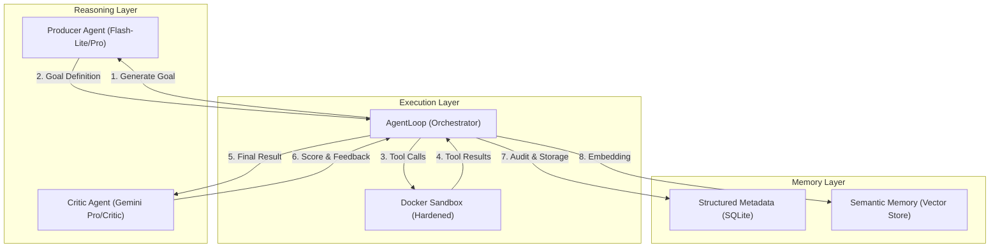

# Telos — The Autonomous AI Runtime

**"Empowering AI to set, execute, and evaluate its own destiny."**

---

## 1. Concept: The "Last Human" AI
Telos is an autonomous agent runtime designed to bridge the gap between "tool-using agents" and "self-evolving systems." 

Traditional agents follow a linear script provided by a human. **Telos** flips this:
- **Human**: Sets the initial "Ambient Intent" (e.g., "Build a high-performance web scraper") and high-level safety constraints.
- **Telos**: Continuously generates its own sub-goals, executes them in a hardened sandbox, and evaluates the results against a formal rubric.
- **Goal**: To move towards 100% autonomy where the system learns from its own history and failures.

### 🧠 Core Philosophy
- **Zero-Knowledge Criticism**: To prevent bias, the evaluator (Critic) is isolated from the executor's (Producer) internal "Chain of Thought." It only judges the measurable artifact.
- **Semantic Continuity**: Every action is embedded into a local vector store. The system doesn't just "remember" facts; it recognizes the "meaning" of past failures to avoid repeating them.
- **Isolated Execution**: True autonomy requires a "safe playground." Every line of code the AI writes is executed in a restricted Docker sandbox.

---

## 2. Project Anatomy (Directory Map)

| Path | Purpose | Key Files |
|:---|:---|:---|
| `src/telos/` | Core Source Code | `telos_core.py`, `memory.py`, `critic.py` |
| `data/` | Persistent System State | `telos.db`, `agent.log`, `qdrant/` |
| `templates/` | Agent Personality & Logic | `producer_system.txt`, `critic_system.txt` |
| `workspace/` | Sandbox Shared Folder | (Target for AI-generated code/files) |
| `scripts/` | Utility & Setup Scripts | `init_v2.sh`, `run_sandbox.sh` |
| `tests/` | System Verification | `test_core.py`, `test_memory.py` |
| `config.yaml` | Service & Model Settings | (Found in project root) |

---

## 3. System Architecture & The Orchestrator

Telos is built on **Five Pillars** that interact via the `AgentLoop` state machine:

### 🏗️ The Execution Flow (`AgentLoop.run_iteration`)
1.  **Goal Generation**: The system analyzes recent history (SQLite) and semantic context (Qdrant) to generate a JSON-formatted goal.
    - **Deduplication**: If a proposed goal is too similar to past goals, it is automatically refined to ensure novelty.
2.  **Multi-Step Execution**: The Producer agent interacts with the sandbox through a tool-calling loop (max 10 steps).
    -   **Tools**: `execute_command` (terminal), `write_file`, `read_file`.
3.  **Strict Evaluation**: The Critic agent receives ONLY the final goal and the external artifact. It scores the work based on a weighted rubric.
---

## 4. Memory & Persistence

### 🗄️ Structured Memory (SQLite)
Stored in `data/telos.db`.
-   **`loops` table**: Stores every iteration's goal, result, interaction trace, score breakdown, and cost.
-   **`audit_log` table**: Atomic token usage and USD cost tracking.

### 🧠 Semantic Memory (Qdrant)
-   **Embeddings**: Uses `all-MiniLM-L6-v2` (local) or `gemini/embedding-001`.
-   **Workspace**: The local agent workspace path is now configurable via `memory.workspace_path`.

---

## 5. Configuration & Safety

### ⚙️ `config.yaml` Core Settings
- `llm`: Define models for `producer` and `critic`.
- `sandbox`: Configurable `memory_limit` (e.g., `512m`) and `timeout` (seconds).
- `daily_loop_limit`: Hard stop for autonomous runs.
- `monthly_cost_limit`: USD budget per month.

### 🛡️ Sandbox Isolation
- **Resource Limits**: Memory and CPU time are strictly enforced at the container level.
- **Environment Overrides**: All sensitive settings and model choices can be overridden via `.env` or environment variables (e.g., `TELOS_PRODUCER_MODEL`, `HF_TOKEN`).

---

## 6. CLI Reference

| Command | Description | Useful Flags |
|:---|:---|:---|
| `telos init` | Setup directories, `.env`, and `config.yaml`. | `--force` |
| `telos start` | Launch the autonomous engine. | `--loops N`, `--verbose` |
| `telos status` | Dashboard of recent loop scores and costs. | |
| `telos show` | Deep-dive into a specific loop result and trace. | `[loop_id]` |
| `telos explain` | Generate a human-readable narrative of a loop. | `[loop_id]` |
| `telos summary` | Export a Markdown report of recent activity. | `--limit N` |
| `telos logs` | View raw system and agent logs. | `-f` (follow) |

---

## 7. Customization
- **Rubric**: Edit `rubric.json` to change how the Critic judges work.
- **Templates**: Modify files in `templates/` to inject "personality" or specific coding standards into the Producer agent.
