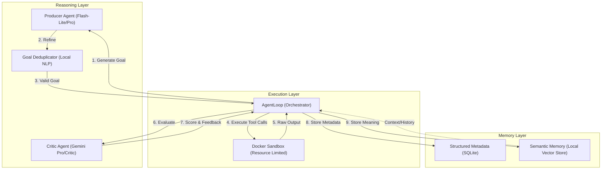

# Telos — The Autonomous AI Runtime

**"Empowering AI to set, execute, and evaluate its own destiny."**

---

## 1. Concept: The "Last Human" AI
Telos is an autonomous agent runtime designed to bridge the gap between "tool-using agents" and "self-evolving systems." 

Traditional agents follow a linear script provided by a human. **Telos** flips this:
- **Human**: Sets the initial "Ambient Intent" (e.g., "Build a high-performance web scraper") and high-level safety constraints.
- **Telos**: Continuously generates its own sub-goals, executes them in a hardened sandbox, and evaluates the results against a formal rubric.
- **Goal**: To move towards 100% autonomy where the system learns from its own history and failures.

### 🧠 Core Philosophy
- **Zero-Knowledge Criticism**: To prevent bias, the evaluator (Critic) is isolated from the executor's (Producer) internal "Chain of Thought." It only judges the measurable artifact.
- **Semantic Continuity**: Every action is embedded into a local vector store. The system doesn't just "remember" facts; it recognizes the "meaning" of past failures to avoid repeating them.
- **Isolated Execution**: True autonomy requires a "safe playground." Every line of code the AI writes is executed in a restricted Docker sandbox.

---

## 2. System Architecture

Telos is built on **Five Pillars** that interact in a continuous cycle:

### 🏗️ The Pillars Explained

1.  **Orchestrator (`AgentLoop`)**: The state machine. It handles retries, rate-limiting, and ensures the system remains within the budget/complexity limits.
2.  **Sandbox (`SandboxManager`)**: A hardened Docker container.
    - **Resource Hardening**: 512MB RAM, 1 CPU, 300s timeout.
    - **Isolation**: Limited network access and temporary filesystem.
3.  **Memory Store**:
    - **SQLite**: The "Cold Storage" for audit logs, costs, and scores.
    - **Qdrant**: The "Deep Learning" layer. Uses **local** `all-MiniLM-L6-v2` embeddings (zero cost) to retrieve similar past goals and outcomes.
4.  **Critic Agent**: The "Strict Teacher." It evaluates work based on:
    - **Completeness**: Did the script actually run and solve the task?
    - **Novelty**: Is this a fresh step or just a repetition?
    - **Coherence**: Does it serve the original Ambient Intent?
5.  **Intelligence Interface**: Powered by `litellm`. It supports Gemini, OpenAI, and Anthropics, allowing for redundant fallbacks.

---

## 3. Persistent Data & Workspace

All critical system data is stored locally in the `data/` directory for total portability:

-   `data/telos.db`: SQLite database (History & Metrics).
-   `data/agent.log`: Full activity stream.
-   `data/qdrant/`: Local vector store segments.
-   `workspace/`: The "Playground" where the AI creates files and code.

---

## 4. CLI Multi-Tool

-   `telos start --loops N`: Begin the autonomous cycle.
-   `telos show`: Instantly view the latest loop's detailed reasoning and score.
-   `telos status`: View a dashboard of recent successes and costs.
-   `telos summary`: Generate an executive Markdown report for human review.

---

## 5. Security & Constraints

Telos is designed with "Safety First" defaults:
- **Daily Loop Limit**: Prevents runaway costs (Defualt: 10, Adjustable).
- **Hard Memory Limits**: Sandbox cannot crash the host machine.
- **Prompt Isolation**: Tools are strictly defined; the agent cannot perform arbitrary host commands.
