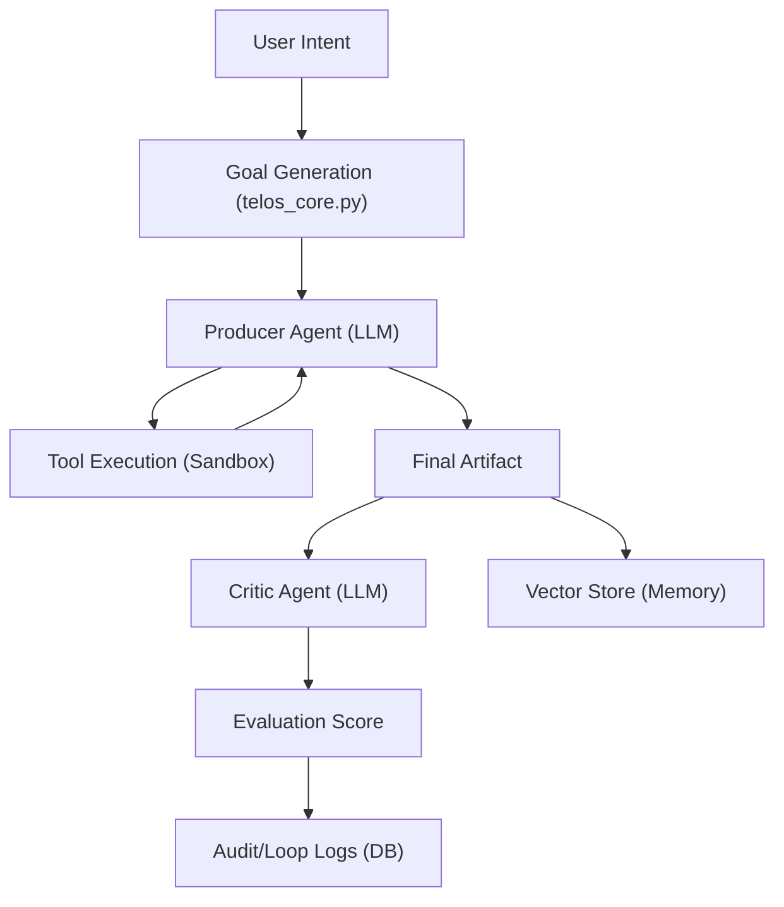

# Telos System Architecture

Telos is an autonomous AI runtime designed for decoupled, model-agnostic, and secure task execution. This document outlines the core components and how they interact.

---

## 1. Core Philosophy
- **Model Agnostic**: Uses `litellm` to allow switching between OpenAI, Anthropic, Gemini, and Local (Ollama) providers via configuration.
- **Secure by Default**: All destructive actions (shell, file writes) occur inside an isolated Docker sandbox.
- **Zero-Knowledge Criticism**: The Producer and Critic are separate instances; the Critic only sees the outcome, not the internal thinking process.

---

## 2. Component Overview

### 2.1 Orchestrator (`telos_core.py`)
The heart of the system.
- **AgentLoop**: Manages the multi-step cycle of:
    1. **Goal Generation**: Analyzes intent and memory to decide the next big task.
    2. **Execution Phase**: A multi-turn conversation where the Producer agent uses tools.
    3. **Criticism**: An independent LLM evaluates the result based on a rubric.
- **TemplateLoader**: Dynamically loads system prompts from `templates/` without changing code.

### 2.2 Tool System (`tools.py` & `telos_core.py`)
- **Plugin Architecture**: Tools are defined by a `Tool` ABC.
- **Standard Tools**:
    - `BashTool`: Shell command execution in sandbox.
    - `WriteFileTool` / `ReadFileTool`: Workspace management.

### 2.3 Sandbox Layer (`sandbox.py`)
- **Docker Integration**: Spawns and kills ephemeral containers for each loop iteration.
- **Isolation**: Prevents AI from accessing the host filesystem or network unexpectedly.

### 2.4 Memory Layer (`memory.py` & `db_models.py`)
- **Short-term (SQLite)**: Tracks `AuditLog` (costs, calls) and `LoopRecord` (status, scores).
- **Long-term (Vector Store)**: Uses Qdrant and LLM embeddings to store and retrieve "experience" summaries for cross-iteration learning.

---

## 3. Data Flow

---

## 4. Configuration & Secrets
- **`config.yaml`**: Managed user preferences (model names, limits).
- **`.env`**: Stores sensitive API keys (never pushed to Git).
- **`templates/`**: Plain text files for prompt engineering.

---

## 5. Security Model
1. **Secrets Isolation**: Keys are environmental, never hardcoded.
2. **Operations Isolation**: Filesystem access limited to the `/workspace` directory in Docker.
3. **Budget Safety**: Mandatory token usage and cost tracking in every LLM call, with hard daily/monthly limits.
